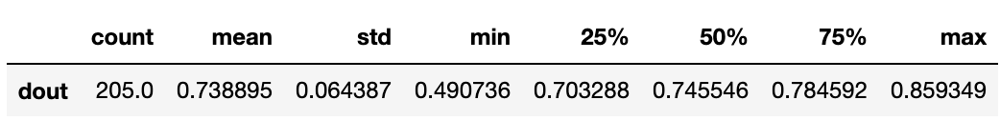
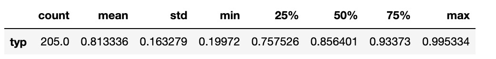
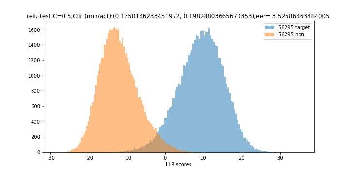

# BA-LR: Toward an interpretable and explainable approach for automatic voice comparison

## Table of content:
* [How it works?](#install)
* [BA-vectors extractor](#extract)
* [BA behavioral parameters](#params)
* [LR Framework](#LR)
* [Interpretability & Explainability](#explain)
## How to install?
To install BA-LR, do the following:

0. Use a conda environment
1. Install requirements:
```sh
pip install -r requirement.txt
```
2. Clone repository:
```sh
git clone https://github.com/Imenbaa/BA-LR.git
```
## BA-vectors extractor
The extractor is trained on Voxceleb2 dataset https://www.robots.ox.ac.uk/~vgg/data/voxceleb/vox2.html. It is composed of a ResNet generator of speech representations optimised for speaker classification task. 
After training phase, we obtain sparse representations (0,x), we replace x to 1 to obtain binary representation. The trained generator parameters are in [model/voxceleb_BA](https://github.com/Imenbaa/BA-LR/tree/main/model/voxceleb_BA/model_dir/).
#### Generator
`Filterbanks -> ResNet generator -> embedding -> Softplus layer() -> Sparse representation`  
#### Speaker Classifier
`Sparse representation -> classifier (i.e. NN projected to num_classes with Softmax) -> class prediction`
#### BA-Vector
`Sparse representation -> BA-vectors`

To extract the trained representations, do the following:
```sh
cd extractor
[TRAIN BAvectors]
python extract.py -m /model/voxceleb_BA/model_dir --checkpoint 2100 -d [WAV_FILES_TRAIN] -f "txt"
[TEST BAvectors]
python extract.py -m /model/voxceleb_BA/model_dir --checkpoint 2100 -d [WAV_FILES_Test] -f "txt"
```

## BA behavioral parameters
Behavioral parameters per BA such as the typicality, typ, and the dropout, dout are calculated based on the train data.
```sh
python BA_params.py --path [TRAIN_DATA]/BAvectors.txt  --typ_path data/typ_BA_soft.txt --dout_path data/dropout_soft.txt
```


The dropin parameter, Din, is related to the noise that could occur in the data. The value of drop-in is tuned on a dedicated set of comparison
pairs extracted from the train corpus, by minimizing the actual Calibrated Log LR, Cllr. The optimised value of dropin
is 0.50 for Cllrmin/act equal to 0.13/0.16 and EER= 2.8. 


## LR Framework
### Partial LRs


### Global LR


## Interpretability & Explainability


