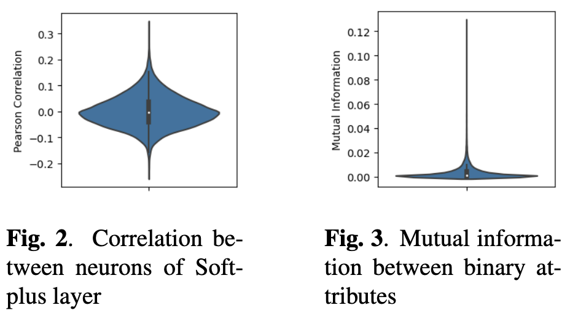

# Describing the phonetics in the underlying speech attributes for deep and interpretable speaker recognition
This github is the implementation of BA-LR approach for speaker recognition. This approach is decomposed of Three steps: 1) the extraction of binary-attribute-based speech representations, 2) the estimation of the attribute behavioral parameters and LR estimation,3) Explainability and interpretability of the nature of those attributes. Below two references of the works published concerning this approach where the first one concerns the presentation of the approach ,mainly step 1 and 2,and the second reference presents a methodology that explains the nature of each attribute contributing to the LR estimation for speaker verification. 

## Table of content:
* [How it works?](#install)
* [BA-vectors extractor](#extract)
* [BA behavioral parameters](#params)
* [LR Framework](#LR)
* [Interpretability & Explainability](#explain)
* [References](#ref)
## How to install?
To install BA-LR, do the following:

0. Use a conda environment
1. Install requirement libraries
2. Clone repository:
```sh
git clone https://github.com/Imenbaa/BA-LR.git
```
## 1) BA-vectors extractor
The extractor is trained with augmented version of Voxceleb2 dataset https://www.robots.ox.ac.uk/~vgg/data/voxceleb/vox2.html. It is composed of a ResNet generator of speech representations optimised for speaker classification task. 
After training phase, we obtain sparse representations of zero's and x's, we replace x with 1 to obtain binary representation. The trained generator parameters are in [model/voxceleb_BA](https://github.com/Imenbaa/BA-LR/tree/main/model/voxceleb_BA/model_dir/).
#### Extractor
`Filterbanks -> ResNet extractor -> embedding -> Softplus layer() -> Sparse representation`  
#### Speaker Classifier
`Sparse representation -> classifier (i.e. NN projected to num_classes with Softmax) -> class prediction`
#### BA-Vector
`Sparse representation -> BA-vectors`

To extract the trained representations, do the following:
```sh
cd extractor
[TRAIN BAvectors]
python extract.py -m /model/voxceleb_BA/model_dir --checkpoint 2100 -d [WAV_FILES_TRAIN] -f "txt"
[TEST BAvectors]
python extract.py -m /model/voxceleb_BA/model_dir --checkpoint 2100 -d [WAV_FILES_Test] -f "txt"
```
#### Correlation between BAs in BA-vector
The BAs coefficients of BA-vector are decorrelated between each other which is proved by the following figure of the pearson correlation:



## 2) BA behavioral parameters
Behavioral parameters per BA such as the typicality, typ, and the dropout, dout are calculated based on the train data.
```sh
python BA_params.py --path [TRAIN_DATA]/BAvectors.txt  --typ_path data/typ.txt --dout_path data/dout.txt
```
## 3) LR framework 
The LR framework is presented as an interpretable and explainable scoring for speaker verification.


## 4) Interpretability methodology
For explanatory variables extraction, we use OpenSmile toolkit https://audeering.github.io/opensmile/get-started.html#default-feature-sets


## References
The ResNet extractor is inspired from this LIA extractor:
https://github.com/Chaanks/stklia 

If you use this repo, please do not forget to cite the following papers related to BA-LR approach. Thanks!
```BibTex
@inproceedings{Benamor2022,
  title={BA-LR: Binary-Attribute-based Likelihood Ratio estimation for forensic voice comparison
},
  author={Imen Ben Amor, Jean-François Bonastre},
  booktitle={IEEE International Workshop on Biometrics and Forensics 2022},
  year={2022},
  organization={IEEE}
}
```
```BibTex
@inproceedings{Benamor2023,
  title={Describing the phonetics in the underlying speech attributes for deep and
interpretable speaker recognition},
  author={Imen Ben Amor, Jean-François Bonastre,Benjamin O’Brien, Pierre-Michel Bousquet},
  booktitle={Interspeech2023},
  year={2023}
}
```


