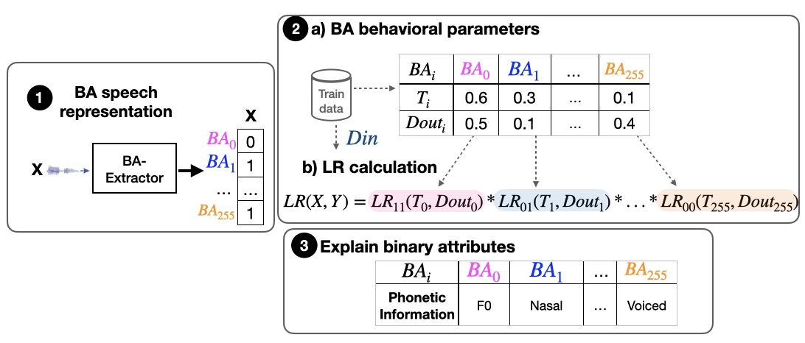
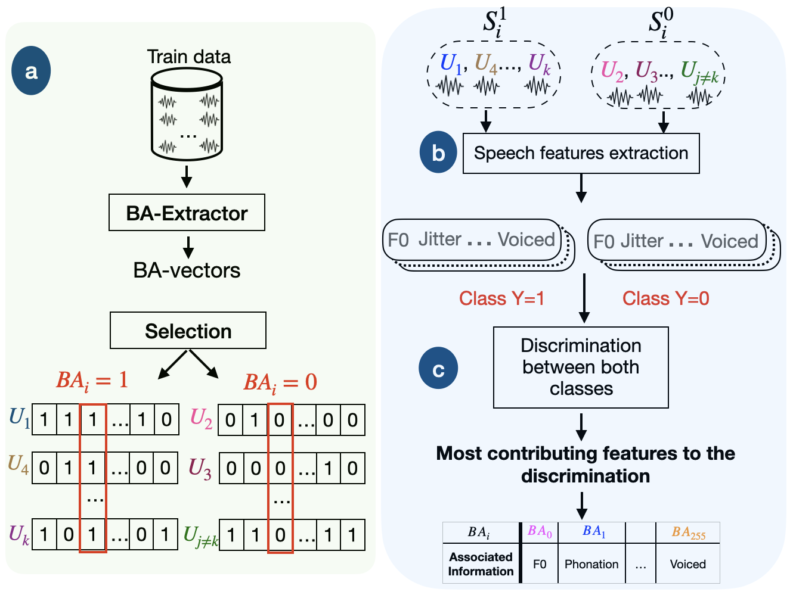

# BA-LR: Towards an interpretable and explainable approach for speaker recognition
This is the implementation of BA-LR approach for speaker recognition. This approach is decomposed of three steps: 1) the extraction of binary-attribute-based speech representations, 2) the estimation of the attribute behavioral parameters and LR estimation, 3) Explainability and interpretability of the nature of the attributes. 
Below two references of the works published concerning this approach where the first one provides a presentation of the approach ,mainly step 1 and 2,and the second reference presents a methodology that explains the nature of each attribute contributing to the LR estimation for speaker verification. 



## Table of content:
* [How to install?](#install)
* [Step1: BA-vectors extractor](#extract)
* [Step2.a: BA behavioral parameters estimation](#params)
* [Step2.b: LR Framework](#LR)
* [Step3: Explain and describe the nature of attributes](#explain)
* [References](#ref)

### How to install? 

To install BA-LR, do the following:

0. Use a conda environment
1. Install dependencies
2. Clone repository:
```sh
git clone https://github.com/LIAvignon/BA-LR.git
```
### 1) Step1: BA-vectors extractor
The extractor is trained with augmented version of Voxceleb2 dataset. It is composed of a ResNet encoder that is trained to generate speaker embeddings optimised for speaker classification task. 
This model takes as input filter bank features that we extract with Kaldi.
In the inference, we obtain sparse representations of values in [0,x], we replace x with 1 to obtain binary representation. 
The trained extractor model is provided in [Step1/model/voxceleb_BA]().

#### Extractor
`Filterbanks -> ResNet extractor -> embedding -> Softplus layer() -> Sparse representation`  
#### Speaker Classifier
`Sparse representation -> classifier (i.e. NN projected to num_classes with ARCMargin Softmax) -> class prediction`
#### BA-Vector
`Sparse representation -> BA-vectors`

To extract filterbanks with kaldi, you should firstly install kaldi.  To install kaldi on ubuntu, follow this tutorial: https://www.assemblyai.com/blog/kaldi-install-for-dummies/
Another step before extracting filterbanks is to prepare your data: 

1) Your wav files should start with the id of speaker and then the name of utterance
2) Create wav.scp file in which you put in each line: [name_of_utterance] [path_of_utterance_wav_file]
3) Create utt2spk file in which you put in each line: [name_of_utterance] [id_of_corresponding_spk]

wav.scp and utt2spk should be in Step1/features_extraction
```sh
export KALDI_ROOT=[PATH_OF_KALDI]
cd Step1/features_extraction
perl feature-extraction.sh --nj 8 --data-in [TRAIN_WAV_FILES] --data-out [DATA_OUTPUT_FOLDER] --features-out [OUTPUT_FOLDER] --kaldi-root kaldi_root //extracts filterbanks
```
If successfully done, you will find a folder of features extracted in Step1/features_extraction/

In Step1/extractor, you can find the files for ResNet training and vectors extraction.

To extract the sparse representations of VoxCeleb1 (test) and 2 (Train) data, do the following:

```sh
cd Step1
[TRAIN BAvectors]
python extractor/extract.py -m /model/voxceleb_BA/model_dir --checkpoint 2100 -d [features_TRAIN] -f "txt"
[TEST BAvectors]
python extractor/extract.py -m /model/voxceleb_BA/model_dir --checkpoint 2100 -d [features_TEST] -f "txt"
```

### Step2.a: BA behavioral parameters estimation
Behavioral parameters per BA such as the typicality, typ, and the dropout, dout are calculated based on the train data.

```sh
cd Step2
python preprocessing/BA_params.py --path [TRAIN_DATA]/BAvectors.txt  --typ_path data/typ.txt --dout_path data/dout.txt
```
This will calculate the typicality and dropout parameters of attributes based on formula in reference 1.

### Step2.b: LR Framework

To calculate the likelihood ratio using BA-LR, we provide an example of jupyter notebook in Step2/LR.

### Step3: Explain and describe the nature of attributes

To describe the phonetic nature of attributes we use the proposed methodology of reference 2.
In Step3/explainability_results, we provide the results describing our attributes. The methodology is described in th following figure:



This methodology is applied on Train data (information is stronger) is decomposed into 3 sub steps: 
a) Extraction of binary vectors and selection of 0 and 1 utterance sets of a given attribute. 
b) Extraction of descriptors from speech utterances using OpenSmile
c) Differentiation between both sets 0 and 1 to evaluate the discrimination ability of the attribute to discriminate 0 and 1 classes. From this differentiations, we can order the descriptors having biggest contribution to this differentiation.

#### Combination of a) and b)
First of all you need to install OpenSmile: there is a python and C++ versions for it. The C++ version is faster.
To use it, you install OpenSmile with: 
```sh
git clone https://github.com/audeering/opensmile.git
cd opensmile/
bash build.sh
sh build.sh
SMILExtract -h
```
We choose to extract the set of descriptors EGemaps fo OpenSMile:

```sh
cd Step3
opensmile/build/progsrc/smilextract/SMILExtract -noconsoleoutput -C opensmile/config/egemaps/v02/eGeMAPSv02.conf -I [Name_file] -csvoutput ./df_opensmile.csv
python selection.py --path_params ./df_opensmile.csv --path_utt_list [List_of_utterances_for_01] --path_BA [OUTPUT_FOLDER]
```

#### c) Methods to classify 0 and 1 sets
We proposed two methods: StepWise Linear Discriminant Analysis and DecisionTree followed by a TreeShap Explainer
```sh
cd Step3
python attribute_slda.py
OR
python attribute_explainer
```

The generated results are in Html files in Step3/explainability_resuls folder.

## References
The ResNet extractor is inspired from this LIA extractor:
https://github.com/Chaanks/stklia 

If you use this repo, please do not forget to cite the following papers related to BA-LR approach. Thanks!
```BibTex
@inproceedings{Benamor2022,
  title={BA-LR: Binary-Attribute-based Likelihood Ratio estimation for forensic voice comparison
},
  author={Imen Ben Amor, Jean-François Bonastre},
  booktitle={IEEE International Workshop on Biometrics and Forensics 2022},
  year={2022},
  organization={IEEE}
}
```
```BibTex
@inproceedings{Benamor2023,
  title={Describing the phonetics in the underlying speech attributes for deep and
interpretable speaker recognition},
  author={Imen Ben Amor, Jean-François Bonastre,Benjamin O’Brien, Pierre-Michel Bousquet},
  booktitle={Interspeech2023},
  year={2023}
}
```


