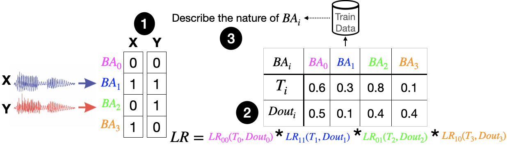
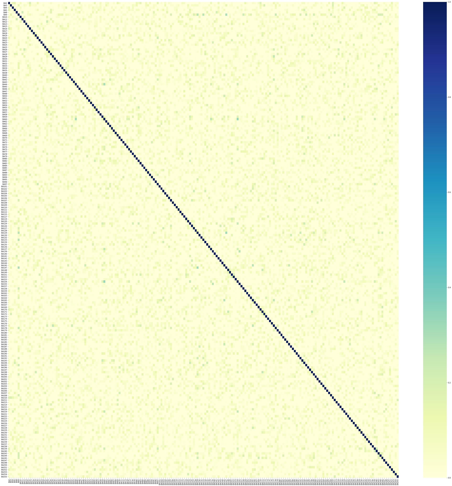
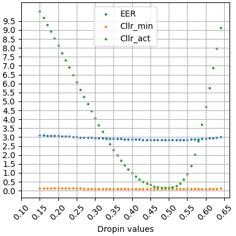
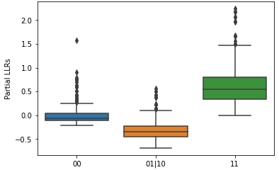
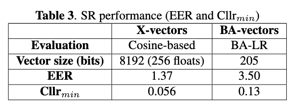
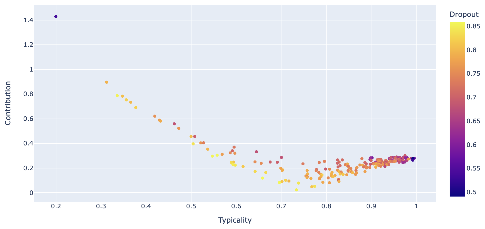
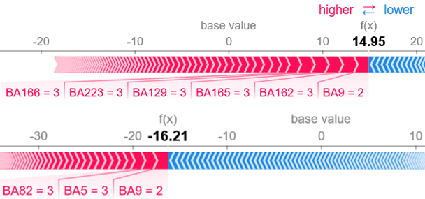

# BA-LR: Toward an interpretable and explainable approach for automatic Speaker Recognition


## Table of content:
* [How it works?](#install)
* [BA-vectors extractor](#extract)
* [BA behavioral parameters](#params)
* [LR Framework](#LR)
* [Interpretability & Explainability](#explain)
* [References](#ref)
## How to install?
To install BA-LR, do the following:

0. Use a conda environment
1. Install requirement libraries
2. Clone repository:
```sh
git clone https://github.com/Imenbaa/BA-LR.git
```
## 1) BA-vectors extractor
The extractor is trained with augmented version of Voxceleb2 dataset https://www.robots.ox.ac.uk/~vgg/data/voxceleb/vox2.html. It is composed of a ResNet generator of speech representations optimised for speaker classification task. 
After training phase, we obtain sparse representations of zero's and x's, we replace x with 1 to obtain binary representation. The trained generator parameters are in [model/voxceleb_BA](https://github.com/Imenbaa/BA-LR/tree/main/model/voxceleb_BA/model_dir/).
#### Extractor
`Filterbanks -> ResNet extractor -> embedding -> Softplus layer() -> Sparse representation`  
#### Speaker Classifier
`Sparse representation -> classifier (i.e. NN projected to num_classes with Softmax) -> class prediction`
#### BA-Vector
`Sparse representation -> BA-vectors`

To extract the trained representations, do the following:
```sh
cd extractor
[TRAIN BAvectors]
python extract.py -m /model/voxceleb_BA/model_dir --checkpoint 2100 -d [WAV_FILES_TRAIN] -f "txt"
[TEST BAvectors]
python extract.py -m /model/voxceleb_BA/model_dir --checkpoint 2100 -d [WAV_FILES_Test] -f "txt"
```
#### Correlation between BAs in BA-vector
The BAs coefficients of BA-vector are decorrelated between each other which is proved by the following figure of the pearson correlation:



## 2) BA behavioral parameters
Behavioral parameters per BA such as the typicality, typ, and the dropout, dout are calculated based on the train data.
```sh
python BA_params.py --path [TRAIN_DATA]/BAvectors.txt  --typ_path data/typ.txt --dout_path data/dout.txt
```

The dropin parameter, Din, is related to the noise that could occur in the data. The value of drop-in is tuned on a dedicated set of comparison
pairs extracted from the train corpus, by minimizing the actual Calibrated Log LR, Cllr. The optimised value of dropin
is 0.50 for Cllrmin/act equal to 0.13/0.16 and EER= 2.8 for train trials.



### Partial LRs


### Gloabl LR




## 3) Interpretability & Explainability

The interpretability of BA-LR approach is illustrated by two aspects. First, the characterisation of each attribute in terms of discriminatory power and reliability. Second, the impact of the attribute behavior on its contribution to the global LR value. For instance, if the behavior of an attribute is very discriminating of the speaker and that attribute is trustworthy, then its contribution to the final LR would be the most important, the most informative and the most reliable. 

<p align="centre">

</p>
If we take a target and a non target voice pair and we try to see the contribution of the different BAs to the final LR decision using Shape figures.
We notice that there are some important BAs that lead the decision to negative or positive values and that have the biggest contribution to the LR.



To be continued...
## References
For the resnet extractor we used:
https://github.com/Chaanks/stklia

If you use this code, please do not forget to cite our paper where the idea of this approach is firstly introduced and got the best paper award. Thanks!
```BibTex
@inproceedings{Benamor2022,
  title={BA-LR: Binary-Attribute-based Likelihood Ratio estimation for forensic voice comparison
},
  author={Imen Ben Amor, Jean-François Bonastre},
  booktitle={IEEE International Workshop on Biometrics and Forensics 2022},
  year={2022},
  organization={IEEE}
}
```


